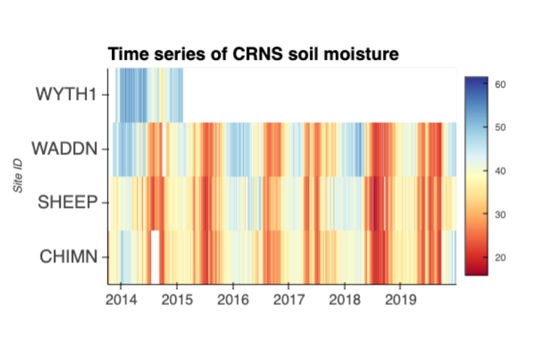

<p align="center">

</p>

# Running on Binder
The notebook is designed to be launched from Binder. 

Click the **Launch Binder** button at the top level of the repository

# Running locally
You may also download the notebook from GitHub to run it locally:
1. Open your terminal

2. Check your conda install with `conda --version`. If you don't have conda, install it by following these instructions (see [here](https://docs.conda.io/en/latest/miniconda.html))

3. Clone the repository
    ```bash
    git clone https://github.com/eds-book-gallery/435f534c-e49b-43c3-9bd6-3393100bef3f.git
    ```

4. Move into the cloned repository
    ```bash
    cd 435f534c-e49b-43c3-9bd6-3393100bef3f
    ```

5. Create and activate your environment from the `.binder/environment.yml` file
    ```bash
    conda env create -f .binder/environment.yml
    conda activate 435f534c-e49b-43c3-9bd6-3393100bef3f
    ```  

6. Launch the jupyter interface of your preference, notebook, `jupyter notebook` or lab `jupyter lab`

# Credits
The **How to run** section was adapted from the [Project Pythia Cookbook](https://cookbooks.projectpythia.org/) project.

